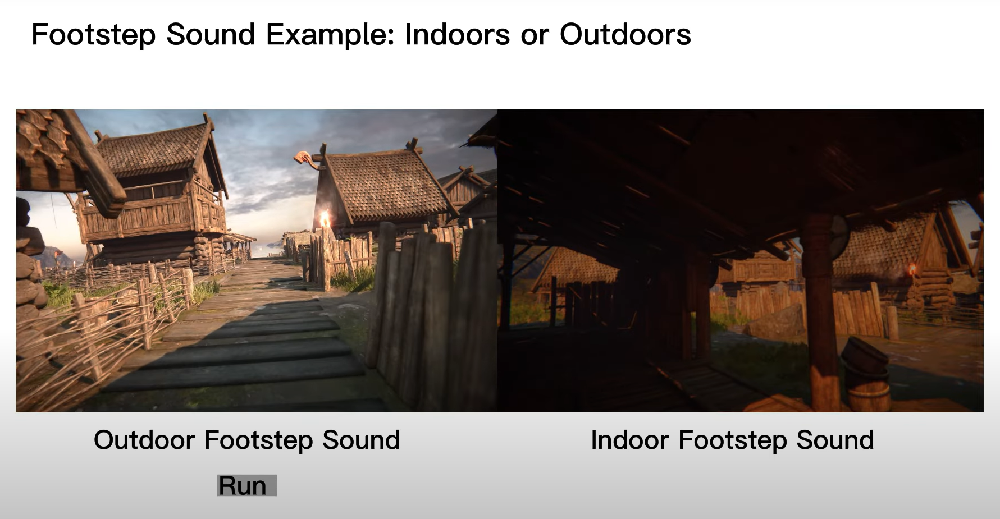

# *Behaviourally-based Synthesis of Scene-aware Footstep Sound*

# Introducation
##
  This is a demo of *Behaviourally-based Synthesis of Scene-aware Footstep Sound*. Try the demo to feel how behaviours and scenes influence footstep sound. Here is the Unity Project download link:
- https://drive.google.com/file/d/1cGjgegC9f3vMLgW8L4dqG2sMCScL_O1r/view?usp=share_link
  
  The scene package name is *Viking Village URP* from Unity Asset Store:
- https://assetstore.unity.com/packages/essentials/tutorial-projects/viking-village-urp-29140
 
# Usage
##
  The version of Unity Engine is 2021.3.16f1c1.

  You should load the scene file *The_Viking_Village.unity* in Unity 3D (URP) Core.
## Basic Inputs:
  Use *W, A, S, D* and mouse to basically control the character.
  
  *LeftShift* to run, *LeftControl* to crawl and *Space* to jump.

  While crawling, press *LeftAlt* to do a high jump.

  If you want to quit the game, press *Escape*.

## Debugging Keys:

  *LeftAlt*: Display the material name under feet.

  *KeyPad 1 - 6*: Transfer the character to six different places.

  *N, M*: Lower or raise the transfer point height of *KeyPad 5 & 6's*.

## [*] Demo Video:
- https://youtu.be/iDY0xn7eX9Y
